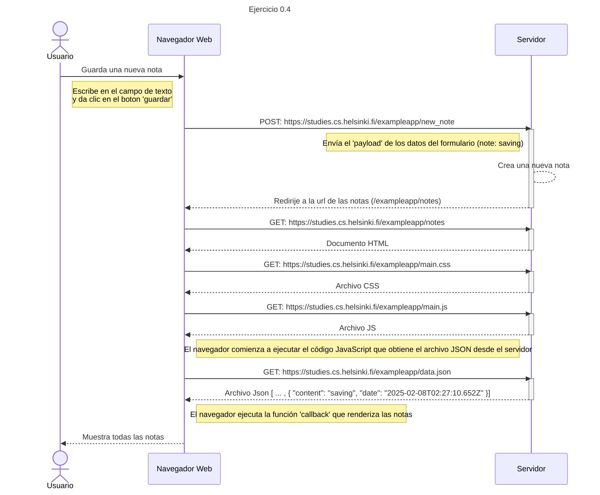

# Ejercicio 0.4 - Nuevo diagrama de nota
Versión en español del diagrama para crear un nueva nota

```mermaid
sequenceDiagram
    title: Ejercicio 0.4

    actor U as Usuario
    participant B as Navegador Web
    participant S as Servidor

    U->>B: Guarda una nueva nota
    Note right of U: Escribe en el campo de texto<br>y da clic en el boton 'guardar'

    B->>S: POST: https://studies.cs.helsinki.fi/exampleapp/new_note
    activate S
    Note left of S: Envía el 'payload' de los datos del formulario (note: saving)
    S-->S: Crea una nueva nota
    S-->>B: Redirije a la url de las notas (/exampleapp/notes)
    deactivate S

    B->>S: GET: https://studies.cs.helsinki.fi/exampleapp/notes
    activate S
    S-->>B: Documento HTML
    deactivate S

    B->>S: GET: https://studies.cs.helsinki.fi/exampleapp/main.css
    activate S
    S-->>B: Archivo CSS
    deactivate S

    B->>S: GET: https://studies.cs.helsinki.fi/exampleapp/main.js
    activate S
    S-->>B: Archivo JS
    deactivate S

    Note right of B: El navegador comienza a ejecutar el código JavaScript que obtiene el archivo JSON desde el servidor

    B->>S: GET: https://studies.cs.helsinki.fi/exampleapp/data.json
    activate S
    S-->>B: Archivo Json [ ... , { "content": "saving", "date": "2025-02-08T02:27:10.652Z" }]
    deactivate S

    Note right of B: El navegador ejecuta la función 'callback' que renderiza las notas

    B-->>U: Muestra todas las notas

```