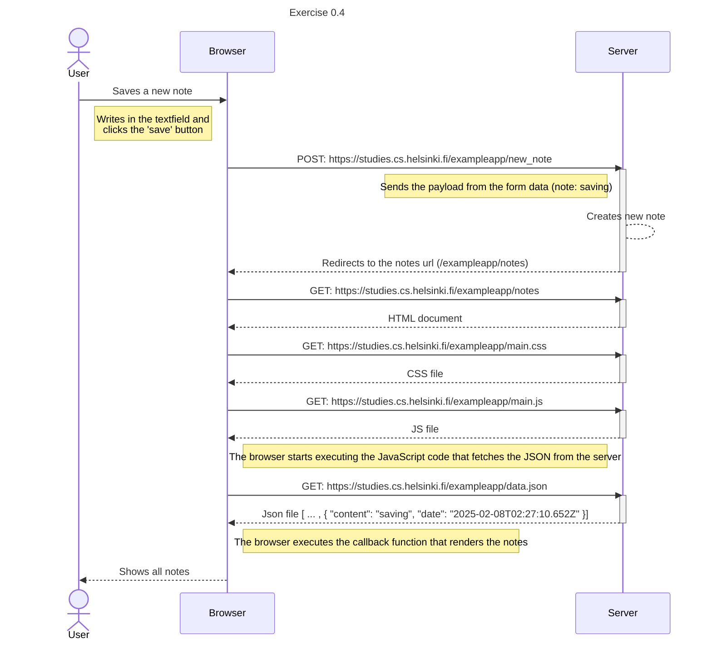

# Exercise 0.4 - New note diagram
Sequence diagram that depicts the situation where the user creates a new note

```mermaid
sequenceDiagram
    title: Exercise 0.4

    actor U as User
    participant B as Browser
    participant S as Server

    U->>B: Saves a new note
    Note right of U: Writes in the textfield and<br> clicks the 'save' button

    B->>S: POST: https://studies.cs.helsinki.fi/exampleapp/new_note
    activate S
    Note left of S: Sends the payload from the form data (note: saving)
    S-->S: Creates new note
    S-->>B: Redirects to the notes url (/exampleapp/notes)
    deactivate S

    B->>S: GET: https://studies.cs.helsinki.fi/exampleapp/notes
    activate S
    S-->>B: HTML document
    deactivate S

    B->>S: GET: https://studies.cs.helsinki.fi/exampleapp/main.css
    activate S
    S-->>B: CSS file
    deactivate S

    B->>S: GET: https://studies.cs.helsinki.fi/exampleapp/main.js
    activate S
    S-->>B: JS file
    deactivate S

    Note right of B: The browser starts executing the JavaScript code that fetches the JSON from the server

    B->>S: GET: https://studies.cs.helsinki.fi/exampleapp/data.json
    activate S
    S-->>B: Json file [ ... , { "content": "saving", "date": "2025-02-08T02:27:10.652Z" }]
    deactivate S

    Note right of B: The browser executes the callback function that renders the notes

    B-->>U: Shows all notes

```