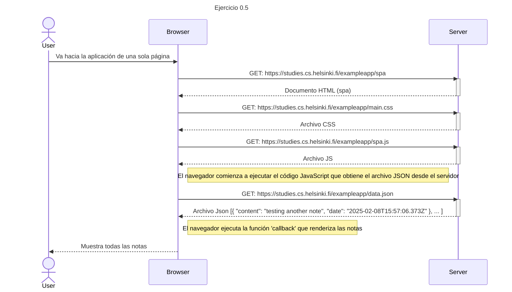

# Ejercicio 0.5 - Diagrama de la aplicación de una sola página
Versión en español del diagrama para la aplicación de una sola página

```mermaid
sequenceDiagram
    title: Ejercicio 0.5

    actor U as User
    participant B as Browser
    participant S as Server

    U->>B: Va hacia la aplicación de una sola página

    B->>S: GET: https://studies.cs.helsinki.fi/exampleapp/spa
    activate S
    S-->>B: Documento HTML (spa)
    deactivate S

    B->>S: GET: https://studies.cs.helsinki.fi/exampleapp/main.css
    activate S
    S-->>B: Archivo CSS
    deactivate S

    B->>S: GET: https://studies.cs.helsinki.fi/exampleapp/spa.js
    activate S
    S-->>B: Archivo JS
    deactivate S

    Note right of B:  El navegador comienza a ejecutar el código JavaScript que obtiene el archivo JSON desde el servidor

    B->>S: GET: https://studies.cs.helsinki.fi/exampleapp/data.json
    activate S
    S-->>B: Archivo Json [{ "content": "testing another note", "date": "2025-02-08T15:57:06.373Z" }, ... ]
    deactivate S

    Note right of B: El navegador ejecuta la función 'callback' que renderiza las notas

    B-->>U: Muestra todas las notas

```