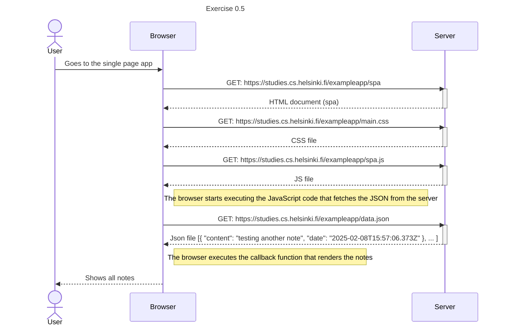

# Exercise 0.5 - Single page app diagram
Sequence diagram that depicts the situation where the user goes to the single-page app version

```mermaid
sequenceDiagram
    title: Exercise 0.5
    
    actor U as User
    participant B as Browser
    participant S as Server

    U->>B: Goes to the single page app
    %%Note right of U: Writes in the textfield and<br> clicks the 'save' button

    B->>S: GET: https://studies.cs.helsinki.fi/exampleapp/spa
    activate S
    S-->>B: HTML document (spa)
    deactivate S

    B->>S: GET: https://studies.cs.helsinki.fi/exampleapp/main.css
    activate S
    S-->>B: CSS file
    deactivate S

    B->>S: GET: https://studies.cs.helsinki.fi/exampleapp/spa.js
    activate S
    S-->>B: JS file
    deactivate S

    Note right of B: The browser starts executing the JavaScript code that fetches the JSON from the server

    B->>S: GET: https://studies.cs.helsinki.fi/exampleapp/data.json
    activate S
    S-->>B: Json file [{ "content": "testing another note", "date": "2025-02-08T15:57:06.373Z" }, ... ]
    deactivate S

    Note right of B: The browser executes the callback function that renders the notes

    B-->>U: Shows all notes

```