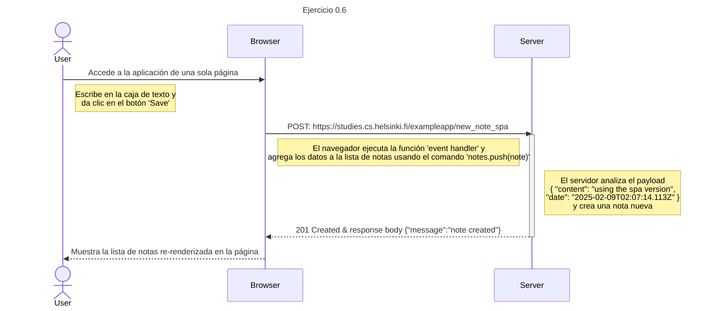

# Ejercicio 0.6 - 
Versión en español del diagrama para la creción de una nueva nota en la aplicación de una sola página

```mermaid
sequenceDiagram
    title: Ejercicio 0.6

    actor U as User
    participant B as Browser
    participant S as Server

    U->>B: Accede a la aplicación de una sola página
    Note right of U: Escribe en la caja de texto y <br>da clic en el botón 'Save'

    B->>S: POST: https://studies.cs.helsinki.fi/exampleapp/new_note_spa
    activate S
    Note right of B: El navegador ejecuta la función 'event handler' y<br> agrega los datos a la lista de notas usando el comando 'notes.push(note)'

    Note right of S: El servidor analiza el payload <br>{ "content": "using the spa version", <br>"date": "2025-02-09T02:07:14.113Z" } <br>y crea una nota nueva
    
    S-->>B: 201 Created & response body {"message":"note created"}
    deactivate S

    B-->>U: Muestra la lista de notas re-renderizada en la página

```