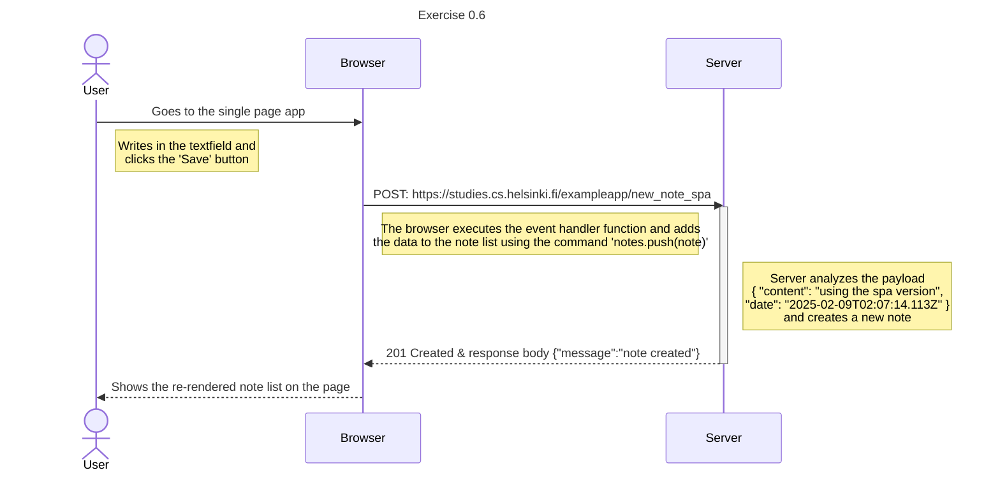

# Exercise 0.6 - New note in Single page app diagram
Sequence diagram that depicts situation where the user creates a new note using the single-page app version

```mermaid
sequenceDiagram
    title: Exercise 0.6
    
    actor U as User
    participant B as Browser
    participant S as Server

    U->>B: Goes to the single page app
    Note right of U: Writes in the textfield and<br> clicks the 'Save' button

    B->>S: POST: https://studies.cs.helsinki.fi/exampleapp/new_note_spa
    activate S
    Note right of B: The browser executes the event handler function and adds<br>the data to the note list using the command 'notes.push(note)'

    Note right of S: Server analyzes the payload <br>{ "content": "using the spa version", <br>"date": "2025-02-09T02:07:14.113Z" } <br>and creates a new note

    S-->>B: 201 Created & response body {"message":"note created"}
    deactivate S

    B-->>U: Shows the re-rendered note list on the page

```